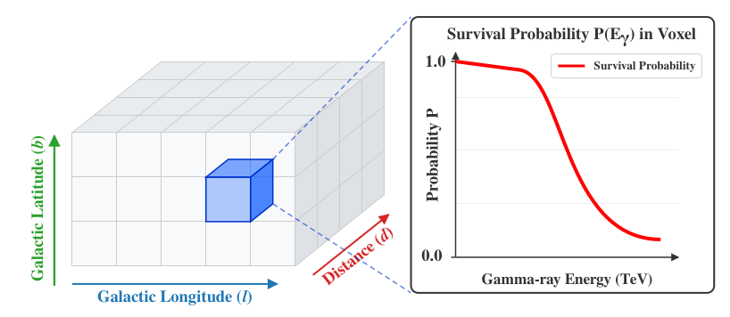

Atlas Structure
===============

   Schematic representation of the GPSP atlas. The three-dimensional Galactic
   grid is defined by Galactic longitude (:math:`l`), Galactic latitude
   (:math:`b`), and source distance (:math:`d`) from the Sun. Each spatial voxel stores
   an energy-dependent photon survival probability profile
   :math:`P(E_{\gamma})`, covering gamma-ray energies from
   1 TeV to 10 PeV.   

Standard GPSP Atlas
-------------------

The standard GPSP atlas is a four-dimensional grid:

::

   (l, b, D, E)

where:

* **Galactic Longitude** (:math:`l`): Covers the full Galactic circle from :math:`0.0^{\circ}` to :math:`359.9.1^{\circ}` with a step size of :math:`0.1^{\circ}` (3600 bins).
* **Galactic Latitude** (:math:`b`): Focuses on the Galactic plane from :math:`-5.0^{\circ}` to :math:`5.0^{\circ}` with a step size of :math:`0.1^{\circ}` (101 bins).
* **Distance** (:math:`d`): Extends from 0.1 kpc to 20.0 kpc with a linear step of 0.1 kpc (200 bins).
* **Energy** (:math:`E`): Covers the range from 1 TeV to 10 PeV, sampled with 20 logarithmically equal bins per decade (81 energy bins). Gamma-ray energy unit used in the GPSP atlas is (eV).

LIV GPSP Atlas
--------------

The LIV atlas adds an additional dimension:

::

   (l, b, D, E, λ)

where λ denotes the LIV scale parameter.

* **Galactic Longitude** (:math:`l`): Covers the full Galactic circle from :math:`0.0^{\circ}` to :math:`359.9.1^{\circ}` with a step size of :math:`0.5^{\circ}` (720 bins).
* **Galactic Latitude** (:math:`b`): Focuses on the Galactic plane from :math:`-5.0^{\circ}` to :math:`5.0^{\circ}` with a step size of :math:`1.0^{\circ}` (7 bins).
* **Distance** (:math:`d`): Extends from 0.1 kpc to 20.0 kpc with a linear step of 0.1 kpc (200 bins).
* **Energy** (:math:`E`): Covers the range from 100 TeV to 10 PeV, sampled with 20 logarithmically equal bins per decade (41 energy bins). Gamma-ray energy unit used in the GPSP-LIV atlas is (eV).
* **LIV parameter** (:math:`\log_{10}(\lambda/E_{\rm Pl})`): -4.5 :math:`\leq` :math:`\log_{10}(\lambda/E_{\rm Pl})` :math:`\leq` -2.0 with steps of 0.05 (51 bins).

Coordinate Units
----------------

================== ==========
Quantity           Unit
================== ==========
Longitude (l)      degree
Latitude (b)       degree
Distance (D)       kpc
Energy (E)         eV
================== ==========

Internal Conventions
--------------------

FITS storage convention:

::

   (E, D, B, L)

NumPy array convention:

::

   (L, B, D, E)

The helper modules automatically handle the axis ordering.
